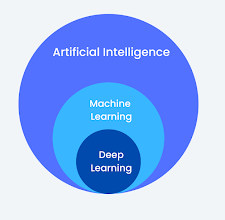
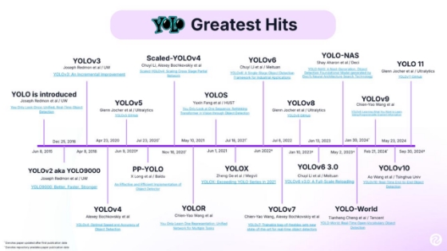

<!-- Summary -->

AI Fundamentals and YOLO

<!--more-->

**Artificial Intelligence (AI)** refers to the simulation of human intelligence in machines. AI enables systems to perform tasks that typically require human cognitive abilities, such as reasoning, problem-solving, learning, and understanding natural language. AI systems analyze data, recognize patterns, and make decisions to achieve specific objectives.

---

## **Categories of AI**
1. **Narrow AI:**  
   - Focused on performing specific tasks effectively.  
   - Examples: Virtual assistants like Alexa or Siri, and recommendation systems.

2. **General AI:**  
   - A theoretical concept where machines can perform any intellectual task that a human can do.  
   - Still a long-term research goal.

---

## **How AI Works**
AI systems process input data, analyze it, and produce outputs based on programmed objectives. The foundational components of AI include:

- **Data:** The raw material for AI, structured (databases) or unstructured (images, videos).  
- **Algorithms:** Instructions guiding machines in processing data and extracting insights.  
- **Models:** Representations of patterns in data used for making predictions or decisions.  
- **Feedback Loops:** Mechanisms for learning from mistakes and improving over time.

---

### **Core AI Techniques**
1. **Natural Language Processing (NLP):** Enables machines to understand and generate human language (e.g., chatbots).  
2. **Computer Vision:** Provides machines with the ability to interpret visual data (e.g., object detection).  
3. **Robotics:** Combines AI with hardware to perform automated tasks.

---

## **Types of Machine Learning**
Machine Learning (ML), a subset of AI, focuses on algorithms that allow systems to learn from data and improve their performance over time.

### **1. Supervised Learning**
   - **Definition:** The algorithm learns from labeled data, where the output is already known.  
   - **Examples:**  
     - Predicting house prices based on features (e.g., size, location).  
     - Image classification (e.g., identifying cats vs. dogs).
   - **Common Algorithms:** Linear Regression, Support Vector Machines (SVM), Neural Networks.

### **2. Unsupervised Learning**
   - **Definition:** The algorithm identifies patterns in unlabeled data without predefined outcomes.  
   - **Examples:**  
     - Customer segmentation for marketing campaigns.  
     - Anomaly detection in network security.
   - **Common Algorithms:** K-Means Clustering, Principal Component Analysis (PCA), Autoencoders.

### **3. Reinforcement Learning**
   - **Definition:** The algorithm learns by interacting with an environment, receiving rewards or penalties for actions.  
   - **Examples:**  
     - Game-playing AI like AlphaGo.  
     - Autonomous vehicle navigation.  
   - **Key Concepts:** Agent, Environment, Reward Signal, Policy.

### **4. Semi-Supervised Learning**
   - **Definition:** A hybrid approach where the algorithm is trained on a small amount of labeled data and a larger amount of unlabeled data.  
   - **Examples:**  
     - Speech recognition systems.  
     - Medical diagnosis models.

### **5. Deep Learning (DL)**
   - A specialized subset of ML using neural networks with multiple layers ("deep" networks).  
   - Powers advanced applications like voice assistants, image recognition, and natural language processing.

---

### **AI vs. ML vs. DL**
| **Feature**      | **Artificial Intelligence (AI)** | **Machine Learning (ML)**            | **Deep Learning (DL)**         |
|-------------------|-----------------------------------|---------------------------------------|---------------------------------|
| **Definition**    | Simulates human intelligence.    | Learns from data without explicit programming. | Utilizes multi-layered neural networks for advanced learning. |
| **Scope**         | Broad.                           | Narrower, a subset of AI.             | Narrower still, a subset of ML. |
| **Examples**      | Robotics, NLP.                   | Recommendation systems, clustering.   | Image recognition, speech processing. |

---

## **YOLO: Object Detection**
**YOLO (You Only Look Once)** is an advanced object detection model that processes an entire image in one pass to detect objects with high accuracy and real-time performance.

### **Key Features of YOLO**
1. Processes the entire image at once, enabling real-time detection.  
2. Simultaneously detects multiple objects in a frame.  
3. Applications: Autonomous vehicles, surveillance, and robotics.

---

### **YOLO vs. OpenCV**
| **Feature**       | **YOLO**                                   | **OpenCV**                              |
|--------------------|-------------------------------------------|------------------------------------------|
| **Approach**       | Detects multiple objects in one pass.     | Processes objects sequentially.          |
| **Speed**          | Extremely fast.                          | Slower for complex tasks.                |
| **Accuracy**       | High for real-time scenarios.            | Dependent on implementation.             |
| **Applications**   | Advanced tasks like real-time detection. | General-purpose image processing tasks.  |

---

### **Versions of YOLO (YOLOverse)**
The current leading version is **YOLOv8**, offering improved detection, versatility, and performance compared to earlier iterations.

---

### **Training a YOLO Model**
1. **Collect and Organize Data:**  
   - Gather and label high-quality images.  
   - Split datasets into training, validation, and test sets.

2. **Label Images:**  
   - Use tools to define object boundaries.  
   - Format labels with Class ID, X/Y center, width, and height.

3. **Setup Training Environment:**  
   - Use platforms like Google Colab or Kaggle.  
   - Configure `.yaml` files with dataset paths.

4. **Train the Model:**  
   - Adjust parameters like epochs, batch size, and input size.  
   - Run the training script.

5. **Evaluate and Deploy:**  
   - Validate model performance with metrics like precision, recall, and mAP.  
   - Deploy trained models (`best.pt`) for real-world applications.

---

### **Key Terminologies**
- **Epochs:** Complete passes over the dataset during training.  
- **Batch Size:** Number of samples processed simultaneously.  
- **Image Size (imgsz):** Dimensions of input images for training.  
- **Pre-trained Weights:** Starting models like `yolov8n.pt` trained on datasets like COCO.  
- **Custom Weights:** Models like `best.pt` fine-tuned for specific applications.

---

### **Resources for YOLO and AI**
- GitHub: [Ultralytics](https://github.com/ultralytics)  
- Documentation: [Ultralytics Docs](https://docs.ultralytics.com/)  
- Platforms: [Roboflow](https://roboflow.com/), [Google Colab](https://colab.research.google.com/).

--- 

This comprehensive guide bridges AI concepts with practical applications, emphasizing machine learning types and advanced tools like YOLO for object detection.