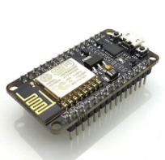

<!-- Summary -->

Getting Started with Microcontroller Programming

<!--more-->

## What Are Microcontrollers?  

A **microcontroller** is a small, programmable computer-on-a-chip used to control devices. They combine:  
- **Processor (CPU):** Executes commands.  
- **Memory:** Stores programs and data.  
- **I/O Ports:** Connects to external devices like sensors, LEDs, and motors.  
- **Peripherals:** Include timers, ADC (Analog-to-Digital Converters), and communication protocols like UART, I2C, and SPI.  

Microcontrollers are essential for embedded systems in appliances, vehicles, and IoT devices. Common types include:  
- **ATmega328P:** Found in Arduino UNO.  
- **ESP8266 and ESP32:** Advanced microcontrollers with Wi-Fi/Bluetooth for IoT.  

---

## What Is Arduino?  

**Arduino** is an open-source platform designed for electronics projects. It simplifies working with microcontrollers using:  
1. **Hardware:** A physical board like the Arduino UNO.  
2. **Arduino IDE:** An easy-to-use development environment for programming boards.  

Arduino is widely used in IoT, robotics, and automation projects. 


---

## The Arduino UNO  

### Key Features  
- **Microcontroller:** ATmega328P  
- **Operating Voltage:** 5V  
- **Digital I/O Pins:** 14 (6 PWM)  
- **Analog Input Pins:** 6  
- **Clock Speed:** 16 MHz  

### Core Functions  

1. **`pinMode()`**: Configures a pin as `INPUT` or `OUTPUT`.  
   ```cpp
   pinMode(pin, INPUT/OUTPUT);
   ```

2. **`digitalWrite()`**: Sets a digital pin to `HIGH` or `LOW`.  
   ```cpp
   digitalWrite(pin, HIGH/LOW);
   ```

3. **`digitalRead()`**: Reads the state of a digital pin.  
   ```cpp
   int state = digitalRead(pin);
   ```

4. **`analogRead()`**: Reads analog input from a pin.  
   ```cpp
   int value = analogRead(pin);
   ```

5. **`analogWrite()`**: Writes a PWM signal to a pin.  
   ```cpp
   analogWrite(pin, value); // Value: 0-255
   ```

6. **`delay()`**: Pauses execution for a specified time (ms).  
   ```cpp
   delay(1000); // 1 second
   ```

---

## Example: Blinking an LED  

```cpp
int ledPin = 13;

void setup() {
  pinMode(ledPin, OUTPUT);
}

void loop() {
  digitalWrite(ledPin, HIGH); // Turn on
  delay(1000);                // Wait 1 second
  digitalWrite(ledPin, LOW);  // Turn off
  delay(1000);                // Wait 1 second
}
```

---

## Arduino IDE Features  

1. **Serial Communication**: Enables communication between your computer and Arduino.  
   - **`Serial.begin()`**: Initializes communication.  
     ```cpp
     Serial.begin(9600); // Baud rate
     ```
   - **`Serial.print()`** / **`Serial.println()`**: Sends data to Serial Monitor.  
     ```cpp
     Serial.print("Hello"); // Sends "Hello"
     Serial.println("World"); // Sends "World" with newline
     ```

2. **Setup and Loop**: Main functions in Arduino programming.  
   - **`setup()`**: Runs once at startup.  
     ```cpp
     void setup() {
       // Initialization code
     }
     ```
   - **`loop()`**: Repeats after setup.  
     ```cpp
     void loop() {
       // Main code
     }
     ```

---


## ESP8266 Microcontroller  



### Key Features  
- **Processor:** 32-bit Tensilica L106 (80 MHz)  
- **Wi-Fi:** 802.11 b/g/n  
- **GPIO Pins:** 11  
- **Memory:** Up to 4 MB Flash  

### Core Functions  

1. **Wi-Fi Connection**  
   ```cpp
   #include <ESP8266WiFi.h>

   const char* ssid = "Your_SSID";
   const char* password = "Your_PASSWORD";

   void setup() {
     WiFi.begin(ssid, password);
     while (WiFi.status() != WL_CONNECTED) {
       delay(500);
     }
   }
   ```

2. **GPIO Control**  
   ```cpp
   pinMode(2, OUTPUT);      // Set GPIO2 as output
   digitalWrite(2, HIGH);   // Set GPIO2 HIGH
   digitalWrite(2, LOW);    // Set GPIO2 LOW
   ```

---

## ESP32 Microcontroller  


### Key Features  
- **Processor:** Dual-core Tensilica Xtensa LX6 (up to 240 MHz)  
- **Wi-Fi:** 802.11 b/g/n  
- **Bluetooth:** BLE and Classic  
- **GPIO Pins:** 34  
- **Additional Features:** Touch sensors, DAC, cryptographic engines.  

### Core Functions  

1. **Wi-Fi Connection**  
   ```cpp
   #include <WiFi.h>

   const char* ssid = "Your_SSID";
   const char* password = "Your_PASSWORD";

   void setup() {
     WiFi.begin(ssid, password);
     while (WiFi.status() != WL_CONNECTED) {
       delay(500);
     }
   }
   ```

2. **GPIO Control**  
   ```cpp
   pinMode(2, OUTPUT);      // Set GPIO2 as output
   digitalWrite(2, HIGH);   // Turn on GPIO2
   digitalWrite(2, LOW);    // Turn off GPIO2
   ```

3. **PWM Control**  
   ```cpp
   ledcSetup(channel, freq, resolution); // Set up PWM channel
   ledcAttachPin(pin, channel);          // Attach pin to channel
   ledcWrite(channel, dutyCycle);        // Set duty cycle (0-255)
   ```

---

## Key Differences: Arduino UNO, ESP8266, and ESP32  

| Feature               | Arduino UNO    | ESP8266          | ESP32                   |
|-----------------------|----------------|------------------|-------------------------|
| Processor             | ATmega328P     | Tensilica L106   | Tensilica Xtensa LX6    |
| Clock Speed           | 16 MHz         | 80 MHz           | Up to 240 MHz           |
| Connectivity          | None           | Wi-Fi            | Wi-Fi + Bluetooth       |
| GPIO Pins             | 14 (6 PWM)     | 11               | 34                      |
| Operating Voltage     | 5V             | 3.3V             | 3.3V                    |
| Applications          | Prototyping    | IoT Projects     | Advanced IoT, Robotics  |

---


Microcontrollers like the Arduino UNO, ESP8266, and ESP32 allow developers to create projects in automation, IoT, and beyond. By understanding their unique capabilities and coding functions, you can choose the right microcontroller for your application.  

### Additional Resources  
- [Arduino Official Website](https://www.arduino.cc)  
- [ESP8266 Documentation](https://www.espressif.com/en/products/socs/esp8266)  
- [ESP32 Documentation](https://www.espressif.com/en/products/socs/esp32)  