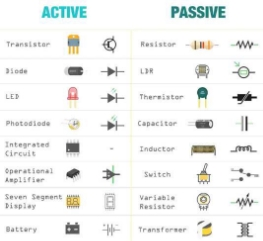
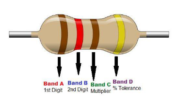
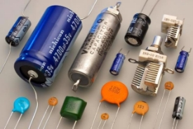
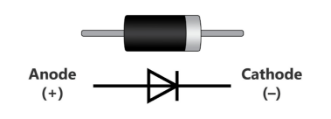
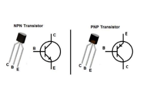
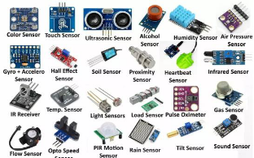
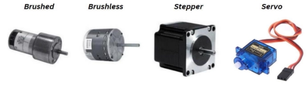
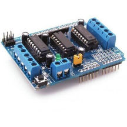
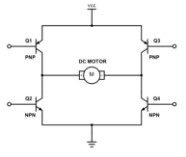
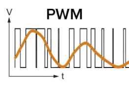

<!-- Summary -->

Basic Electronics for Robotics

<!--more-->

# Basic Electronics for Robotics  

Electronics plays a crucial role in robotics, as robots rely on electronic systems to sense, process, and act in their environment. Robotics combines principles of electronics, mechanics, and software to create machines that can perform tasks autonomously or semi-autonomously. This section explores essential electronic components and concepts that form the backbone of robotic systems.

---

## Key Components in Robotics Electronics  

Robotic systems consist of several core electronic components that enable sensing, computation, and actuation. These include resistors, capacitors, diodes, transistors, sensors, motors, and motor drivers. Let's explore these components in the context of their use in robotics.  

---

### Resistor  

Resistors limit the flow of electrical current, ensuring circuits operate safely and within design parameters. In robotics, resistors are used for:  
- **Current Limitation**: Protect sensitive components like LEDs and sensors.  
- **Voltage Division**: Create specific voltage levels using resistor networks, critical for analog sensor interfacing with microcontrollers.  
- **Signal Conditioning**: Smooth electrical signals in circuits.  

**Example in Robotics**: Resistors are essential in pull-up or pull-down configurations to stabilize digital signals in microcontrollers.  

---

### Capacitor  

Capacitors store and release electrical energy, playing a vital role in:  
- **Power Supply Stability**: Filtering noise and maintaining steady voltage in power systems.  
- **Timing Circuits**: Working with resistors in oscillators or delay circuits for timed actions in robots.  
- **Signal Coupling**: Blocking DC components and allowing AC signals in communication circuits.  

**Example in Robotics**: Capacitors smooth voltage fluctuations in motor driver circuits, preventing signal interference from motor noise.  

---

### Diode  

Diodes ensure current flows in a single direction, preventing damage from reverse currents. Specialized diodes like **Schottky diodes** and **Zener diodes** are used for:  
- **Flyback Protection**: Protecting circuits from voltage spikes caused by inductive loads like motors.  
- **Voltage Regulation**: Stabilizing power supplies in sensitive circuits.  

**Example in Robotics**: Diodes are integral to motor driver circuits to prevent back EMF from damaging control electronics.  

---

### Transistor  

Transistors serve as switches or amplifiers in robotics. They enable:  
- **Actuation Control**: Switching high-current loads like motors and relays using low-power signals from microcontrollers.  
- **Signal Amplification**: Boosting weak sensor signals for processing.  
- **Logic Gates**: Forming the building blocks of digital logic circuits.  

**Example in Robotics**: MOSFETs (a type of transistor) are widely used for controlling DC motors due to their high efficiency and fast switching.  

---

### Sensors  

Sensors are critical for robots to perceive and interact with their environment. They convert physical quantities into electrical signals. Some common sensors in robotics include:  
- **Proximity Sensors**: Detect nearby objects using infrared, ultrasonic, or capacitive methods.  
- **Temperature Sensors**: Monitor heat levels to protect electronic components or ensure process accuracy.  
- **IMUs (Inertial Measurement Units)**: Provide acceleration and orientation data for navigation and stability.  
- **Encoders**: Measure rotational position or speed for motor feedback.  
- **Cameras and LiDAR**: Enable visual and spatial perception for advanced tasks like object detection and mapping.  

**Example in Robotics**: Infrared sensors are used for obstacle avoidance in line-following robots, while encoders ensure precise motor positioning in robotic arms.  

---

### Motors  

Motors are the primary actuators in robotics, converting electrical energy into mechanical motion. Types of motors used in robotics include:  
- **Brushed DC Motors**: Simple and cost-effective, ideal for basic robotic applications.  
- **Brushless DC Motors**: More efficient and durable, commonly used in drones and high-performance robots.  
- **Stepper Motors**: Provide precise positional control, often used in CNC machines and 3D printers.  
- **Servo Motors**: Combine a motor with a feedback system for accurate position control, ideal for robotic arms and humanoid robots.  

**Example in Robotics**: A robotic gripper may use a servo motor for precise opening and closing, while the robot's wheels may use brushless motors for efficient movement.  

---

### Motor Drivers  

Motor drivers manage the power and control signals needed to operate motors safely and efficiently. Common motor drivers include:  
- **L293D IC**: A popular motor driver IC for low-power robotics applications, capable of driving DC and stepper motors.  
- **H-Bridge Circuits**: Enable bidirectional control of motors by reversing voltage polarity.  
- **MOSFET-Based Drivers**: Provide high efficiency and are suitable for high-current applications.  

**Example in Robotics**: An H-bridge circuit is used to control the direction and speed of a robotic car's wheels. 

---

### PWM (Pulse Width Modulation)  

PWM is a key technique in robotics to control power delivery. By varying the duty cycle of a signal, PWM allows fine control of motor speed, light intensity, and servo position.  

**Applications in Robotics**:  
- **Motor Speed Control**: Adjust the duty cycle to vary motor speed without wasting energy.  
- **Servo Positioning**: Generate PWM signals to control the angle of servo motors.  
- **Power Efficiency**: Efficiently manage power to reduce heat generation in circuits.  

---

### Microcontrollers  

Microcontrollers (MCUs) are the brains of most robots, processing sensor data, executing control algorithms, and sending actuation commands. Popular microcontrollers include:  
- **Arduino**: A beginner-friendly platform for prototyping robots.  
- **Raspberry Pi**: A single-board computer for advanced robotics with image processing.  
- **ESP32**: A microcontroller with integrated Wi-Fi and Bluetooth for IoT robotics.  

**Example in Robotics**: An Arduino Nano might control a line-following robot, while a Raspberry Pi runs computer vision algorithms for a robot detecting objects.  

---

## Advanced Robotics Concepts  

### Feedback Control Systems  

Robotics often relies on closed-loop systems where sensors provide feedback to adjust motor actions dynamically. For example:  
- **PID Control**: Proportional-Integral-Derivative control ensures accurate motor positioning or speed regulation.  
- **Kalman Filters**: Used for sensor fusion, combining data from IMUs and GPS for smooth navigation.  

### Communication Systems  

Robots communicate internally and externally using protocols like:  
- **I2C, SPI, UART**: For interfacing sensors and modules with microcontrollers.  
- **Wi-Fi, Bluetooth, ZigBee**: For wireless communication in IoT robots.  
- **CAN Bus**: Common in autonomous vehicles for robust communication between control units.  

### Power Systems  

Robots require stable and reliable power sources, typically using:  
- **Li-ion or Li-Po Batteries**: Lightweight and energy-dense, ideal for mobile robots.  
- **Power Distribution Boards**: Distribute power to various components safely.  

---

This detailed exploration bridges the basics of electronics with the advanced systems and concepts essential for building effective robotic systems. From sensors and actuators to microcontrollers and motor drivers, these components form the foundation of robotic innovation.

---

## External References for Further Learning

- [Basic Electronics - Instructables](https://www.instructables.com/Basic-Electronics/)  
- [Electronics Tutorials](https://www.electronics-tutorials.ws/)  
- [Troubleshooting Electronic Motors - eCampusOntario](https://ecampusontario.pressbooks.pub/btec315biomedicalinstrumenttroubleshooting/chapter/troubleshooting-electronic-motors/)  

