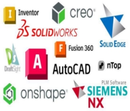
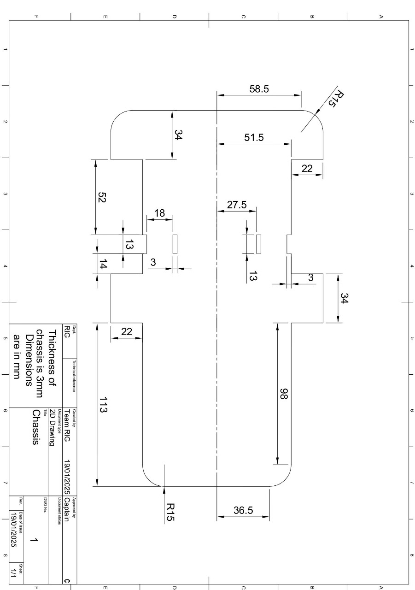
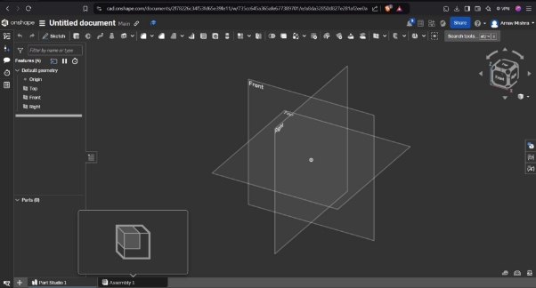
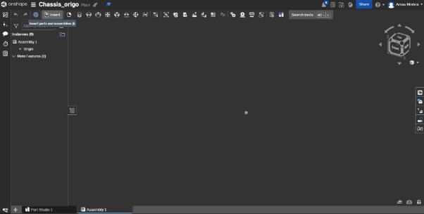
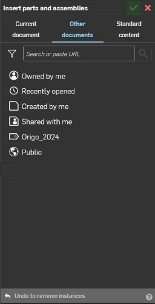
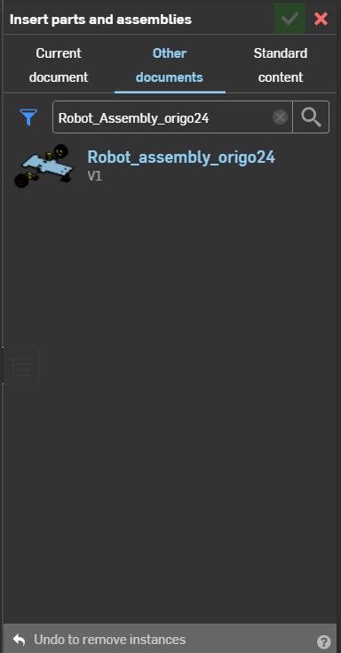
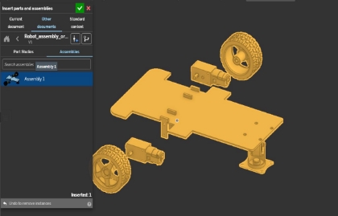
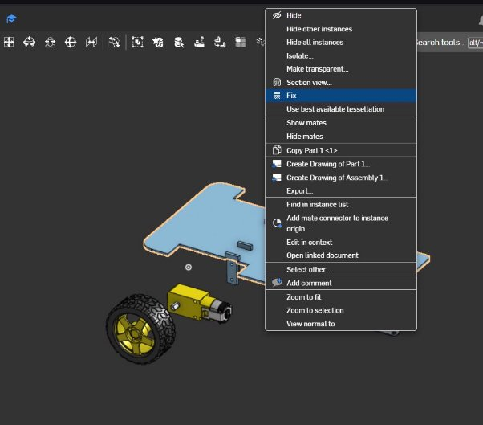
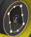
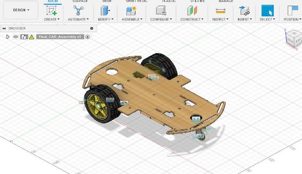

---
title: Computer Aided Design (CAD)
date: 2025-01-10T18:08:19+05:30
lastmod: 2025-01-10T18:08:19+05:30
author: ORIGO
# avatar: /img/author.jpg
# authorlink: https://author.site
cover: cover.png
images:
  - cover.png
categories:
  - category1
tags:
  - cad
  - design
  - basics
  - handout
  - rignitc
# nolastmod: true
draft: false
---

<!-- Summary -->

CAD Designing

<!--more-->

# **What is CAD?**

Computer-Aided Design (CAD) is a technology that allows users to digitally create 2D drawings and 3D models of real-world products. This powerful tool facilitates the design, simulation, and modification of prototypes before they are manufactured. CAD enables seamless collaboration among teams, leading to the development of innovative, high-quality products that can reach the market faster.

---

## **CAD Software/Tools**

CAD software provides specialized tools tailored to different industries, such as architecture, industrial design, and electronics. Some CAD tools are versatile and can be used across a variety of fields, while others are industry-specific. Below is a list of widely used CAD tools:

- **SolidWorks**
- **AutoCAD**
- **Fusion 360**
- **CATIA**
- **TinkerCad**
- **CREO**
- **Onshape**
- **SIEMENS NX**
- **LibreCAD**
- **DraftSight**
- **Solid Edge**
- **Altium Designer**

---

## **Onshape: Cloud-Based CAD Software**

Onshape is a cutting-edge, cloud-based CAD platform. It allows users to collaborate in real time on a single model through web-based servers, making it an ideal choice for industries involved in product design, machine parts, and industrial equipment. 

### **Key Features of Onshape:**
- **Collaboration:** Teams can work on the same design simultaneously, streamlining the design process.
- **Document Organization:** Instead of native file formats, Onshape stores design data within "Documents," which act as project-level containers. These containers hold assemblies, parts, drawings, imported components, and other project-related data.
- **Cross-Compatibility:** Supports importing and exporting files in multiple industry-standard formats.
- **Cloud-Based Access:** Accessible through compatible web browsers after signing in.

# **Assembly Guide**
---

#### **Chassis Drawing (CAD Sketch)**  

#### **Step 1: Accessing the Assembly Tab**
1. After partially creating the chassis, navigate to the **Assembly tab** located at the bottom of the screen by left-clicking on it.  
   - **Note:** The Assembly tab is automatically created when you start a new document.

   

---

#### **Step 2: Inserting an External Assembly**
1. Left-click on **Insert** in the top panel.  
   

2. A drop-down menu will appear with the following options: **Current Document**, **Other Documents**, and **Standard Document**.

3. Navigate to **Other Documents.**  
   

4. Paste the following URL into the provided box:  
   [https://cad.onshape.com/documents/692cce191c77a3a06298e5dc/w/aafea05b38b3a608edf34070/e/839bcfdc334e62e3cf4d626e](https://cad.onshape.com/documents/692cce191c77a3a06298e5dc/w/aafea05b38b3a608edf34070/e/839bcfdc334e62e3cf4d626e)

   **OR**  

   - Go to **Public** and search for "**Robot_assembly_origo24**."
   - Select the appropriate item from the results.  
     

---

#### **Step 3: Adding the Assembly**
1. In the selected file, locate **Part Studios** and **Assemblies.**  
   - **Note:** Part Studios will be empty since the file is an assembly. Click on **Assemblies.**  
     

2. Select **Assembly 1.** Move your cursor to the workspace and left-click to place the assembly where desired.  
   

3. Click the **green tick** at the top to confirm placement.

---

### **Assembly Instructions**

---

#### **Motor Joints**

1. Hover the cursor over the chassis without left-clicking. The chassis will display yellow borders.  
   - Right-click and select **Fix** from the menu.  
       

     **Note:** If you accidentally left-clicked, press **Esc** to deselect. Fixing the chassis is crucial to visualize joints properly.

   

2. Select **Fastened Mate** from the toolbar.  
   

3. Click on the top hole of the motor's surface. A **Mate Connector** will appear.

4. Rotate the view to locate the top hole on the T-shaped fastener. Click on it. The motor will align with the location.

5. Confirm by clicking the **green tick.**  
     

   **Reference Video:** [Motor Joint Tutorial](https://drive.google.com/file/d/117BkUs9KKydtb5tudTVtzojljx1_O2rk/view?usp=drive_link)

6. Repeat the same process for the second motor joint.  

   **Reference Video:** [Second Motor Joint](https://drive.google.com/file/d/1UAaUDlgTTc8Y-Yq2M6ygimkj-jqVIfSn/view?usp=drive_link)

7. To exit the Fastened Mate tool, click the **X** or press **Esc.**  

---

#### **Castor Wheel Joint**

1. Reorient the castor wheel:
   - Left-click the wheel to activate a **triad.**  
     
   - Rotate the wheel along two axes to align its holes with the chassis.

   **Reference Video:** [Castor Wheel Alignment](https://drive.google.com/file/d/1c-h8V48cOshhsTSpIC_m6ByOCCTrVB5d/view?usp=sharing)

2. Create a joint between one hole on the castor wheel and one on the chassis using **Fastened Mate** (same technique as the motor joint).  

   **Reference Video:** [Castor Wheel Joint](https://drive.google.com/file/d/1JIQZ1hrnKRWTfHGBJsfkvYBlZ5m8z95F/view?usp=sharing)

---

#### **Revolute Joint**

1. Select **Revolute Mate** from the toolbar. This mate requires two points of selection.  
   

2. First, click the **center of the tire.** Ensure accuracy in selection to avoid misaligned orientations.

3. Next, select the **center point** from the three points available on the motor shaft's inner surface.  
   

4. Click the **green tick** to confirm the joint.

   **Reference Video:** [Revolute Joint](https://drive.google.com/file/d/1pvm8jDB6_F1Fptup9NNgstpbMKHzCYdO/view?usp=drive_link)

5. Repeat this process for the second wheel.

---

### **Final Check**
Verify that your project functions as intended by testing the joints:  
[Project Test](https://drive.google.com/file/d/1DmE0_3EmAdQ4izTXCALSD3Vh3-dphu2t/view?usp=drive_link)

#### **Completed Chassis (3D Model)**  
