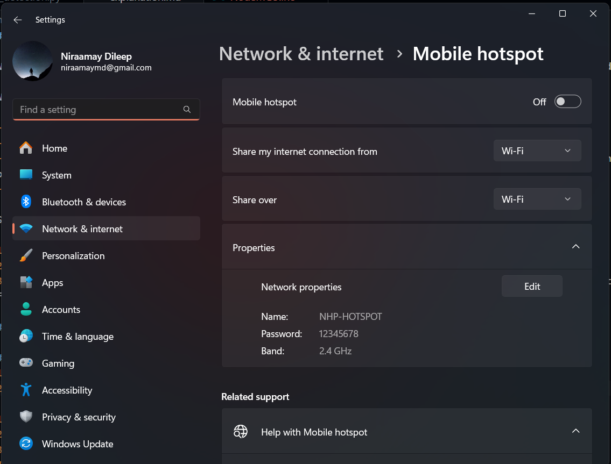
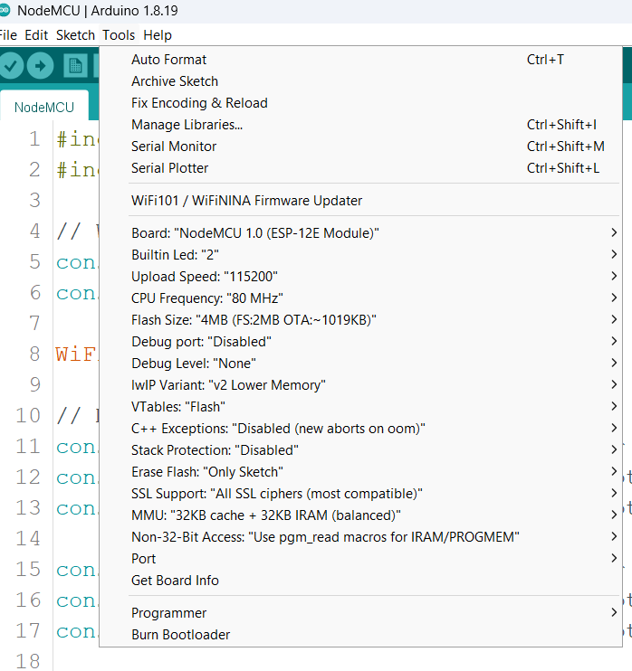
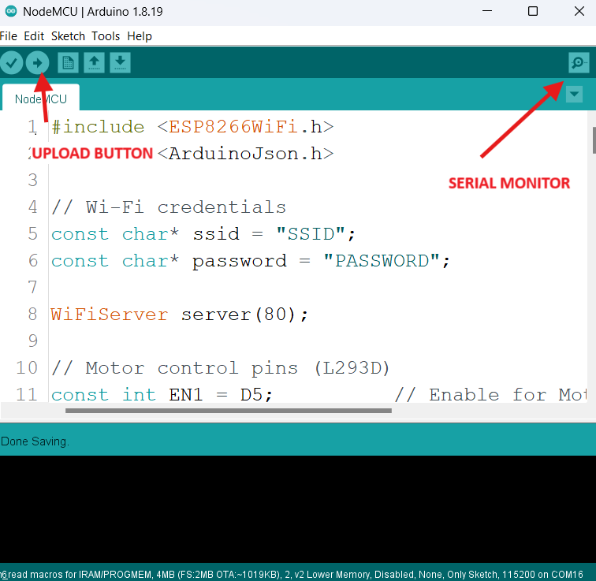

<!-- Summary -->
Day 02: Building a Person-Following Robot with YOLO and PID Control

<!--more-->

# **DAY 2 - Person Following Robot**

We are going to integrate YOLO into our robot so that it can detect a person and follow them around. 

We are going to accomplish this in this way:

- Place our phone on the robot and use its camera to get video feed
- Identify a person in the video stream using YOLO and get their position
- Rotate the robot so that the center of the robot (i.e center of the video feed) coincides with the position of the person detected
- Once the center coincides, move forward

So we need to:

1. Get video stream from our phone
2. Get position of person using YOLO
3. Use a PID Controller to get the required PWM signals needed to rotate the wheels so as to make the center of the video feed and the position of the person coincident.

## CODE 

[LINK TO CODE](https://drive.google.com/file/d/1xeWB9TR9jSzmF2UY5I5Wnl7XP-cAZOcT/view)

## STEPS TO IMPLEMENT:

*Make sure Arduino IDE, Python, VS Code, and IPWebcam is installed as per the pre-workshop guide.

### Mobile Hotspot
1. Search for mobile hotspot on your laptop.

2. Check the `Properties` section and make sure that the `Band` is 2.4 GHz. If not, click the `Edit` button and change it. 
3. Note the `Name` and `Password` of the hotspot.
3. Switch the hotspot on.

### NodeMCU

1. Connect the NodeMCU to your laptop.
2. Open `NodeMCU.ino` in [NodeMCU folder](https://drive.google.com/file/d/1xeWB9TR9jSzmF2UY5I5Wnl7XP-cAZOcT/view) in Arduino IDE. Click the `Tools` button.

3. In `Board`, choose "NodeMCU 1.0 (ESP-12E Module)".
4. If `Port` is greyed out:
    - Make sure that you have connected NodeMCU to the laptop.
    - Make sure you have installed the required drivers
        - Go to this G-drive [link](https://drive.google.com/drive/folders/1mW2N0dRUXK9hYm13JKqF4--l8CSG38TW), download the entire zip file, extract it & then Install the recommended version for your OS
        - After installing, restart the laptop.
5.  Click the `Upload` button.

- If there is any error like "Timed out... Connecting...":
    - Try removing the NodeMCU slowly from the breadboard and then uploading. 
6. Once successfully uploaded, open the Serial monitor (button in the top-right)
7. It should show "Connecting to Wifi...". And then once connected, "Connected to Wi-Fi. IP Address:". The IP that follow's is your **ESP IP** that should be used in the Python file.

### IP Webcam

1. Connect your phone to same mobile hotspot from your laptop.
2. Open IPWebcam.
3. Scroll down and click `Video Preferences`.
4. Set the `Video Resolution` to 640x360
5. Set the `Quality` to about 20.
6. Set the `FPS Limit` to 5. (These settings are made so that it won't lag much when processing with YOLO)
7. Click the 3 dot menu button on top-right and click `Start Server`
8. Note down the IPv4 URL given in the bottom of the video stream. This will be used in the Python file.


### Python server

1. Download the [.zip file](https://drive.google.com/file/d/1xeWB9TR9jSzmF2UY5I5Wnl7XP-cAZOcT/view) for the code and extract it.
2. Open VS Code
3. Click `File` in the top-left. Then click `Open Folder` and open the extracted folder.
4. Double click on `person_detection.py` in VS Code.
5. Change `ESP_IP` to the NodeMCU IP we got from the Serial Monitor.
6. Change `VIDSTREAM` to the IPV4 URL from IPWebcam + '\video'
7. Run the python file with the Run button (Triangle button) in the top-right of VSCODE
    - If not seen, install the Python extension in VS CODE. Click `Ctrl+Shift+X`. Search for python and install the extension.
- If any error like package not found:
    - Run <br>
    `py -m pip install opencv-python mediapipe simple_pid torch tensorflow pandas ultralytics` <br>
    or <br>
    `python -m pip install opencv-python mediapipe simple_pid torch tensorflow pandas ultralytics`
    
### PID Tuning

- You need to adjust the Kp, Ki, Kd values so that the robot rotates such that the person becomes the center of the frame and the robot charges forward.
- Start with slowly increase Kp, until the robot starts oscillation about the person's position.
- Then slowly increase Ki and Kd to reduce the steady state error and oscillations.
---

## Code Explanation
 
```py
import cv2
import json
import socket
import signal
import sys
from simple_pid import PID
import torch
```

- cv2: OpenCV - For capturing the video stream and displaying it.
- json: For converting dictionaries into JSON (will be explained later)
- socket: For establishing TCP communication
- signal, sys: In our case, only used to ensure clean exit
- simple_pid: Easy to use PID library
- torch: A ML Library to use the YOLO model    

```py
model = torch.hub.load('ultralytics/yolov5', 'yolov5s')  
```

YOLO is an deep learning-based object detection model. PyTorch is a machine learning library used to build, train and deploy deep learning models. So we use PyTorch to actually use the YOLO model.

```py
ESP_IP = "192.168.137.57"  
ESP_PORT = 80         

client_socket = socket.socket(socket.AF_INET, socket.SOCK_STREAM)
client_socket.connect((ESP_IP, ESP_PORT))   
print(f"Connected to ESP at {ESP_IP}:{ESP_PORT}")   
```
This is used to establish TCP communication between the NodeMCU and our laptop. 
`ESP_IP` should be set according to the IP Of the NodeMCU connection.


```py
def send_over_socket(param_dict): 
    json_data = json.dumps(param_dict) + '\n'
    encoded_data = json_data.encode()
    client_socket.sendall(encoded_data)
    print(f"Sent: {json_data.strip()}")
```
This is a helper function to send data over TCP. We cannot send data directly from dictionary format through TCP. Only bytes can be sent.

> DICTIONARY > JSON > BYTE > TCP

#### JSON?

JSON is Javascript Object Notation. It's a text-based data format for representing structured data, widely used for data exchange between systems. It is a universal format that can be understood by any language. JSON is stored as a **string**. 

We can only send bytes over TCP. Dictionaries cannot be directly encoded to bytes. But strings can be. Since JSON is stored as a string we can encode that into bytes and send it over using TCP. 

`json.dumps()` is used to convert a dictionary into json. We add the new line character `\n` to this so that we can identify end of the message which receive the bytes in the NodeMCU. 

`json_data.encode()` is used to convert the JSON string into bytes

`client_socket.sendall()` is used to actually send the data across the TCP connection.

```py
def signal_handler(signal, frame):
    send_over_socket({"pwmR": 0, "pwmL": 0})
    sys.exit(0)

signal.signal(signal.SIGINT, signal_handler) 
```
This is a function that is run when the program exits (which is represented by `signal.SIGINT` i.e Signal Interrupt). It just tells the robot to stop moving when the server (python file in our laptop) stops since we don't want the robot to move even when we have shutdown our python file.


```py
# Initialize PID controller
pid = PID(0, 0, 0, setpoint=0)

# Slider functions for PID tuning
def slider_kp(val):
    pid.Kp = round(val * 0.1, 3)

def slider_ki(val):
    pid.Ki = round(val * 0.01, 3)

def slider_kd(val):
    pid.Kd = round(val * 0.1, 3)

# Create a window with trackbars for PID tuning
Winname = 'PID Slider'
cv2.namedWindow(Winname)
cv2.createTrackbar('Kp', Winname, 0, 100, slider_kp)
cv2.createTrackbar('Ki', Winname, 0, 100, slider_ki)
cv2.createTrackbar('Kd', Winname, 0, 100, slider_kd)
```

This initializes the PID Controller. Also, it defines the sliders neccessary to adjust the gains. 

```py
# For video capture
VIDSTREAM = "http://192.168.137.154:8080/video"
cap = cv2.VideoCapture(VIDSTREAM)

# If there is video available
if cap.isOpened():
    width = int(cap.get(cv2.CAP_PROP_FRAME_WIDTH))
    height = int(cap.get(cv2.CAP_PROP_FRAME_HEIGHT))
    pid.setpoint = width // 2 # Set the setpoint to the center of the frame
    pid.output_limits = (-250, 250)
```

This starts the capture of video from our phone. Then we calculate the width and height of the image. 

The PID setpoint is set as the center of the frame. This is because we want to rotate the robot until the position of the person detected coincides with the center of the video frame.

We set the PID output limits as -250, 250 since the output is PWM values and it has a maximum of 255. We are not going for 255 since it is not that good for the safe working of the motors.

```py
while cap.isOpened():
    success , frame = cap.read() # Get the video frame
    if not success:
        continue

    # YOLOv5 inference
    results = model(frame)
```

With this we are reading each frame of the video and getting the results of the YOLO model for each of those frames.

```py
    labels, coords = results.xyxyn[0][:, -1], results.xyxyn[0][:, :-1]
```

What exactly does this `results.xyxyn` return. `xyxyn` denotes the **normalized coordinates** of the bounding boxes of the objects detected by the model. 

What are normalized coordinates? We can define it as coordinates that have been scaled down to be between  0 and 1. 
For example, let's say we are considering a frame of 1000 pixels width and 500 pixels height. Let's consider a point denoted by the pixel coordinates (500,100). This would be denoted in normalized coordinates as (0.5,0.2) since 500 is 0.5\*1000 and 100 is 0.2\*500.

Why do we use `results.xyxyn[0]`? Actually, we can give multiple frames at a time in `model(frame)`. But since in our case, we have given only one frame, we want to access only that first (0 index) frame. 

`results.xyxyn[0]` is of a form:
```
[ [x1, y1, x2, y2, conf, class], # For the first object detected
  [x1, y1, x2, y2, conf, class], # For the second object detected 
  ...
  ]
```

where `x1, y1` represents the normalized coordinates of the top left of the bounding box and `x2, y2` represents the bottom right point. 
`conf` represents the confidence of the YOLO model's prediction.
`class` denotes what sort of object YOLO thinks it is i.e the label of the object. 

So when we access `results.xyxyn[0]` with [:,-1], we getting the labels/classes of all the objects that were detected and with [:,:-1] we are getting everything except the last element (the class) of all the objects.

```py
    for i in range(len(labels)):
        if labels[i] == 0:  
            x1, y1, x2, y2, conf = coords[i] 
            x1, y1, x2, y2 = int(x1 * width), int(y1 * height), int(x2 * width), int(y2 * height)
            cx, cy = (x1 + x2) // 2, (y1 + y2) // 2
            
            cv2.rectangle(frame, (x1, y1), (x2, y2), color, 2)
            cv2.circle(frame, (cx, cy), 5, color, -1)
            cv2.putText(frame, f"Person ({conf})", (x1, y1 - 10), cv2.FONT_HERSHEY_SIMPLEX, 0.9, color, 2)
```

We are looping through all the objects detected and checking if they are a person (since the label of a person = 0 in the pre-trained YOLOv5 model we are using). 
We are converting the normalized coordinates into pixel coordinates of the bounding box and calculating its center. We are drawing the box, its center and adding text showing its confidence level. 

```py
            if (width//2)-100 < cx < (width//2)+100:
                param_dict["pwmL"] = param_dict["pwmR"] = 255
                
            else:
                pwm = int(pid(cx))
                param_dict["pwmL"] = -pwm
                param_dict["pwmR"] = pwm
```

`(width//2)-100 < cx < (width//2)+100` basically tells the robot that if the center of the person detected is at the center of the image (with a passable error of about 100 pixels to the left and right), the robot should move forward at full speed.

If it is not at the center, we use PID to set the rotation of the robot. Based on the center of the person detected, the PID controller gives an output pwm (based on the gains we had chosen) and we give one motor positive pwm and the other negative pwm to rotate it. 

```py
            threshold = 150
            if pwm > 0:
                pwm += threshold
            else: 
                pwm -= threshold
```

We have to give a minimun threshold to the motors since all non-high end motors will have the issue of not rotating at low PWM values.


```py
else:
        # If nothing is detected
        param_dict["pwmL"] = 0
        param_dict["pwmR"] = 0
```

This is the case when nothing has been detected. The robot should not move in that situation, hence we are giving the pwm as 0. 

## NodeMCU Code 

Most of the code is same as the Day 1 NodeMCU code.

The difference arises in handing the JSON data. We use a library called `ArduinoJSON` to handle JSON.

```cpp
        String jsonString = client.readStringUntil('\n');
        jsonString.trim();

        DynamicJsonDocument doc(200);

        DeserializationError error = deserializeJson(doc, jsonString);
        if (error) {
          Serial.println("parseObject() failed");
        } else {
          int pwmL = doc["pwmL"];
          int pwmR = doc["pwmR"];
          Serial.printf("\n L - %d , R - %d\n", pwmL, pwmR); 
          motorL(pwmL);
          motorR(pwmR);
        }
```

`client.readStringUntil('\n')` is used to read the bytes over TCP until we reach the new line character. And `jsonString.trim()` is used to remove the newline character. 

We define a `DynamicJsonDocument`. This acts like the dictionary we use in python. 

We use the`deserializeJson` function to convert the jsonString into a dictionary. In case there is any error, it is stored in `error`. Otherwise, the parsed JSON document is stored in `doc`. Once we get the dictionary in `doc`, we can access the pwm simply like we did in python itself.

Once we get the pwm values needed, we give it to the left and right motors.

--- 


