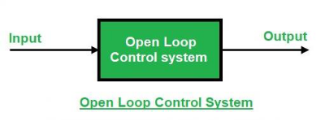
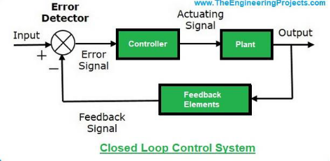
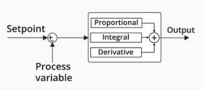

<!-- Summary -->

Understanding Controllers in Systems

<!--more-->

Control systems are an integral part of modern engineering, enabling precise regulation of various processes and systems. This guide covers the key concepts, components, and types of controllers, emphasizing their applications and importance in achieving optimal system performance.

---

## **Key Definitions**

### **1. System**
A **system** is a combination of physical components working together to achieve a specific goal.  
**Example:** A vehicle is a system designed for the transportation of passengers or goods.

---

### **2. Control**
**Control** refers to the act of commanding, directing, or regulating a system to ensure it performs as intended.  
**Example:** Adjusting a motor's input voltage to regulate its speed.

---

### **3. Plant or Process**
The **plant** or **process** is the part of the system that requires control.  
**Example:** In a heating system, the plant is the heater that changes the temperature.

---

### **4. Input and Output**
- **Input:** The signal or excitation supplied to a control system.  
  **Example:** The desired room temperature in a thermostat-controlled heating system.
- **Output:** The actual response of the system.  
  **Example:** The current room temperature in the same system.

---

### **5. Error**
The **error** in a control system is the difference between the desired output (setpoint) and the actual output.  
\[ \text{Error (e(t))} = \text{Desired Output} - \text{Actual Output} \]

---

### **6. Controller**
A **controller** is a device that compares the system's output with the desired output and adjusts the input to minimize the error.  
**Example:** A thermostat regulating a heater.

---

### **7. Stability**
**Stability** determines whether a system can consistently follow an input command without producing unbounded or uncontrollable outputs.

---

### **8. Actuator**
An **actuator** converts the controller’s commands into mechanical actions to influence the plant.  
**Example:** A motor controlling a valve in a water pipeline.

---

### **9. Design**
**Design** involves creating the forms, parts, and details of a system to achieve specific objectives, such as optimizing a control system for a power plant.

---

### **10. Block Diagrams and Signal Flow Graphs (SFG)**
- **Block Diagram:** Graphically represents system components and their transfer functions using blocks.  
- **Signal Flow Graph (SFG):** Depicts the flow of signals between components with nodes and directed branches.

---

### **11. Optimization**
**Optimization** adjusts system parameters to achieve the best possible performance.  
**Example:** Reducing energy consumption in a cooling system.

---

### **12. Feedback Signal**
A **feedback signal** is the system's output used to adjust the input for achieving the desired performance. Negative feedback is commonly used for stabilization.

---

## **Open-Loop vs. Closed-Loop Systems**

### **Open-Loop Control System**
Operates based on a fixed input without considering the output.  
**Example:** A washing machine with a timer.

---

### **Closed-Loop Control System**
Uses feedback from the output to adjust the input, providing higher accuracy and adaptability.  
**Example:** An automatic temperature control system.

| Feature                              | Open-Loop Control System                            | Closed-Loop Control System                          |
|--------------------------------------|----------------------------------------------------|----------------------------------------------------|
| **Feedback**                         | No feedback.                                       | Feedback is present.                               |
| **Intelligence**                     | Cannot be intelligent.                            | Intelligent controlling action.                   |
| **System Oscillation (Hunting)**     | No possibility of oscillation.                    | Possible oscillation due to feedback.             |
| **Output Variability for Constant Input** | Output remains constant (if parameters are stable). | Output may vary due to feedback.                  |
| **Response to Parameter Changes**    | Sensitive to parameter variations.                | Less sensitive to parameter variations.           |
| **Error Detection**                  | Error detection is not present.                   | Error detection is present.                       |
| **Bandwidth**                        | Small bandwidth.                                   | Large bandwidth.                                  |
| **Stability**                        | More stable.                                       | Less stable or prone to instability.              |
| **Effect of Non-linearities**        | Affected by non-linearities.                      | Less affected by non-linearities.                 |
| **Sensitivity**                      | Very sensitive.                                    | Less sensitive to disturbances.                   |
| **Design Complexity**                | Simple design.                                     | Complex design.                                   |
| **Cost**                             | Cheaper.                                           | More expensive.                                   |

---

## **PID Controller**

A **PID Controller** (Proportional-Integral-Derivative Controller) is a sophisticated control mechanism designed to dynamically minimize error and enhance system performance.

### **Components of a PID Controller**
1. **Proportional (P):** Reacts to the current error.
   - Provides output proportional to the error magnitude.  
   - Larger errors lead to stronger corrective actions.  
   **Example:** Driving faster when farther from the destination.

2. **Integral (I):** Considers the accumulation of past errors.
   - Eliminates steady-state errors by addressing persistent deviations.  
   **Example:** Gradually increasing speed if consistently moving too slowly.

3. **Derivative (D):** Responds to the rate of error change.
   - Predicts future errors and smooths the system's response.  
   **Example:** Slowing down early when approaching a destination rapidly.

---

### **How PID Components Work Together**
- **P:** Provides immediate response to error.  
- **I:** Corrects long-term deviations.  
- **D:** Prevents sudden changes and stabilizes the system.

### **Benefits of PID Controllers**
- Combines the strengths of proportional, integral, and derivative actions.  
- Provides fast response and steady performance.  
- Minimizes overshoot, oscillations, and steady-state error.

---

## **External References for Further Learning**

### Websites:
- [TutorialsPoint: Control Systems](https://www.tutorialspoint.com/control_systems/index.htm)  
- [GeeksforGeeks: Control Systems](https://www.geeksforgeeks.org/control-system/)  
- [SREC Warangal: Control Systems Summary](https://www.srecwarangal.ac.in/ece-itl/CS%20SUMMARY.pdf)

### YouTube Videos:
- [Control Systems Series](https://www.youtube.com/watch?v=HcLYoCmWOjI&list=PLBlnK6fEyqRhqzJT87LsdQKYZBC93ezDo)  
- [Introduction to PID Controllers](https://www.youtube.com/watch?v=fv6dLTEvl74)  

By understanding these concepts, you can design, analyze, and optimize control systems effectively to meet various application requirements.