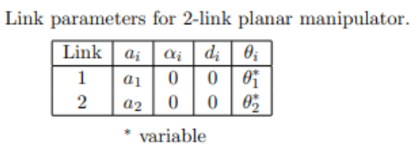
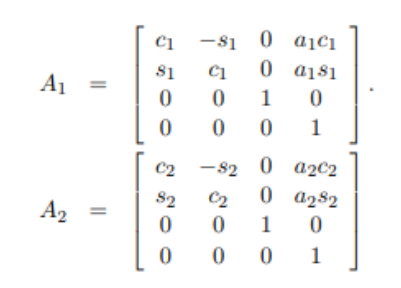
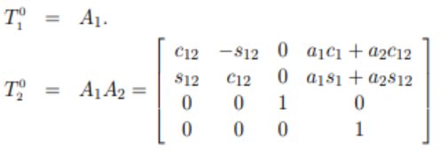
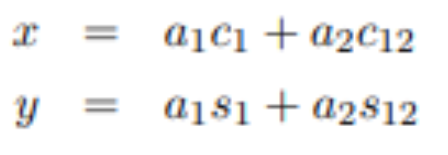

<!-- Summary -->
Mechanics and Kinematics
<!--more-->

---

## 1. Forward Kinematics

**Concept:**

Forward Kinematics (FK) is the process of calculating the **position and orientation** of a robot’s end-effector (e.g., its gripper or hand) based on known **joint angles** and **link geometry**.

- **Input:** A set of joint angles (e.g., 45°, 90°)  
- **Output:** Cartesian coordinates (X, Y, Z) and orientation of the end-effector.

**How it Works:**

Think of it like giving step-by-step directions:
> “From the base, rotate the first joint 45°, extend the second link 30 cm, rotate the next joint 90°, and extend the last link 40 cm.”

Forward kinematics uses mathematics to determine **exactly** where the end-effector ends up after following these instructions.  
It is **deterministic** — meaning, one input gives one clear output.

---

## 2. Inverse Kinematics

**Concept:**

Inverse Kinematics (IK) does the **opposite** of FK — it determines the **joint angles** needed to position the end-effector at a **desired target location**.

- **Input:** Desired Cartesian coordinates (X, Y, Z) and orientation.  
- **Output:** The joint angles that achieve that pose.

**Why It’s More Complex:**

While FK gives a **single** solution, IK can have:

- **Multiple solutions** (e.g., “elbow up” or “elbow down”).  
- **A single solution**, or  
- **No solution** if the target is outside the robot’s reachable workspace.

IK is vital for **robot path planning**, since we usually know *where* we want the robot to go — not *how* it must move its joints to get there.

---

## 3. Denavit–Hartenberg (DH) Convention

The **Denavit–Hartenberg (DH) convention** provides a standardized method to assign coordinate frames to each link of a robot manipulator.  
This method simplifies describing the robot’s geometry for both FK and IK analysis.

---

### Core Idea

The DH convention represents each link using **four parameters**, applied in a specific order to relate one joint to the next.

### The Four DH Parameters

1. **Link Length (a):** Distance between joint axes (common normal).  
2. **Link Twist (α):** Angle between Z-axes of consecutive links, measured about the X-axis.  
3. **Link Offset (d):** Distance along the Z-axis between links (variable for prismatic joints).  
4. **Joint Angle (θ):** Angle about the Z-axis between X-axes (variable for revolute joints).

---

### The DH Procedure

1. **Assign Frames:** Attach a (X, Y, Z) frame to each joint following DH rules.  
2. **Determine Parameters:** For each pair of frames, find the four DH parameters (a, α, d, θ).  
3. **Create Transformation Matrices:** Use these to form 4×4 homogeneous transformation matrices for each link.  
4. **Multiply Matrices:**  
   Combine all transformations to get the total transformation from base to end-effector:

   $$
   T_{total} = T_{base}^0 × T_0^1 × T_1^2 × \ldots × T_{n-1}^n
   $$

The resulting matrix gives the **position and orientation** of the end-effector relative to the base.

---

The figure shows a **2-Link Planar Robotic Arm**.

The goal is to find the mathematical expressions for the **end-effector position (x, y)**, given:
- Link lengths $ a_1, a_2 $
- Joint angles $ θ_1, θ_2 $

---

### DH Parameter Table

For the 2-link arm, the robot’s geometry can be represented using a DH table:

---

### Transformation Matrices

Each link’s transformation is defined by a **4×4 homogeneous matrix**, based on its DH parameters:

---

### Composite Transformation

To find the end-effector’s pose relative to the base:

$$
^0T_2 = A_1 × A_2
$$

This multiplication results in a composite matrix:

---

### End-Effector Equations

From the composite transformation matrix $ T_2^0 $:

$$
x = a_1 \cos(θ_1) + a_2 \cos(θ_1 + θ_2)
$$  
$$
y = a_1 \sin(θ_1) + a_2 \sin(θ_1 + θ_2)
$$

---

**Notation Used in Images:**

- $ c_1 = \cos(θ_1) $
- $ s_1 = \sin(θ_1) $
- $ c_{12} = \cos(θ_1 + θ_2) $
- $ s_{12} = \sin(θ_1 + θ_2) $

---

