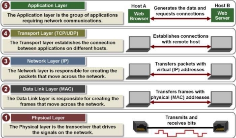
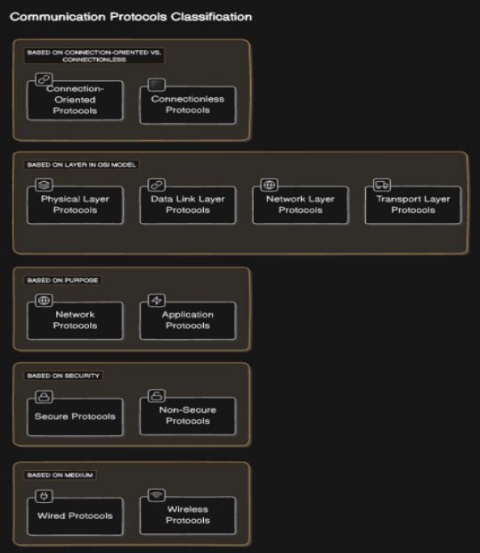

<!-- Summary -->

Networking and Serial Communications

<!--more-->

Networking and serial communications form the backbone of modern data systems, enabling devices to communicate and exchange data efficiently. This document outlines the core concepts of networking, delves into the types and protocols of serial communications, and explores their applications.

---

## **What is a Network?**
A **network** consists of two or more computers or devices linked together to share resources, exchange files, or enable electronic communication.

### **Types of Networks**
1. **LAN (Local Area Network):**  
   - Connects devices over a small geographical area (e.g., home, office, or campus).  
   - Offers high-speed data exchange.  

2. **PAN (Personal Area Network):**  
   - Designed for short-range communication between personal devices.  
   - Examples: Bluetooth and USB connections.  

3. **MAN (Metropolitan Area Network):**  
   - Extends over a city or a large campus, connecting multiple LANs.  

4. **WAN (Wide Area Network):**  
   - Spans a vast geographical area, such as countries or continents.  
   - Example: The Internet.

---

## **Serial Communications**

**Serial communication** is a method of transmitting data sequentially, one bit at a time, over a communication channel. It is widely used in embedded systems, industrial automation, and low-cost data exchange setups.

### **Types of Serial Communication**
1. **Asynchronous Serial Communication:**
   - Data is sent without a clock signal.  
   - Requires **start** and **stop bits** to mark the beginning and end of each data byte.  
   - Common protocol: **UART (Universal Asynchronous Receiver-Transmitter)**.

2. **Synchronous Serial Communication:**
   - Data transfer is synchronized using a shared clock signal between the sender and receiver.  
   - Faster and more efficient than asynchronous methods.  
   - Examples: **SPI (Serial Peripheral Interface)** and **I²C (Inter-Integrated Circuit)**.

3. **Full-Duplex vs. Half-Duplex Communication:**
   - **Full-Duplex:** Data flows in both directions simultaneously. Example: USB.
   - **Half-Duplex:** Data flows in one direction at a time. Example: RS-485.

---

### **Common Serial Communication Protocols**
1. **RS-232:**  
   - A widely used standard for serial communication in computers and industrial devices.  
   - Allows point-to-point communication over short distances.  

2. **RS-485:**  
   - Supports multiple devices on the same bus, making it ideal for industrial automation.  
   - Can operate over longer distances than RS-232.  

3. **I²C (Inter-Integrated Circuit):**  
   - A two-wire protocol for communication between microcontrollers and peripherals.  
   - Used in sensors and small embedded systems.

4. **SPI (Serial Peripheral Interface):**  
   - A high-speed, full-duplex protocol for short-distance communication.  
   - Commonly used in microcontroller systems for interfacing with memory, sensors, and displays.

5. **CAN (Controller Area Network):**  
   - Designed for robust communication in automotive and industrial environments.  
   - Supports priority-based messaging.

6. **USB (Universal Serial Bus):**  
   - A versatile standard for connecting peripherals to computers and other devices.  
   - Offers high-speed data transfer and plug-and-play capabilities.

---

## **TCP/IP Model**
The **TCP/IP model** is a suite of communication protocols used to connect devices in a network. It consists of the following layers:

1. **Application Layer:**  
   Interfaces with the user and manages high-level communication protocols (e.g., HTTP, FTP).  

2. **Transport Layer:**  
   Ensures reliable data delivery with protocols like TCP or fast, connectionless delivery with UDP.  

3. **Network Layer:**  
   Handles routing and addressing of data packets using protocols like IP.  

4. **Data Link Layer:**  
   Manages node-to-node data transfer and error detection.  

5. **Physical Layer:**  
   Deals with the transmission of raw binary data over physical mediums.

---

### **UDP vs. TCP Comparison**
| **Feature**                         | **UDP**                                                | **TCP**                                             |
|-------------------------------------|--------------------------------------------------------|----------------------------------------------------|
| **General Description**             | Simple, fast protocol for sending discrete messages.   | Reliable protocol ensuring ordered data delivery.  |
| **Connection Setup**                | Connection-less; no prior setup needed.                | Connection-oriented; requires a session setup.     |
| **Data Structure**                  | Message-based; discrete packets.                      | Stream-based; continuous data flow.               |
| **Reliability**                     | Unreliable; no delivery acknowledgment.               | Reliable; ensures data delivery and acknowledgment.|
| **Speed**                           | Very high.                                             | High, but slower than UDP due to error checking.   |
| **Applications**                    | Video streaming, gaming.                              | File transfer, email, web browsing.               |

---

By integrating serial communication types with networking concepts, engineers can build robust systems for real-time applications, industrial automation, and interconnected devices. This synergy enables reliable, efficient, and scalable solutions for modern technological challenges.