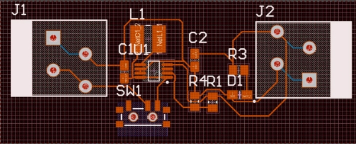
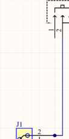
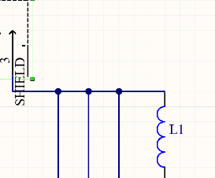
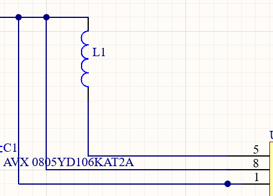
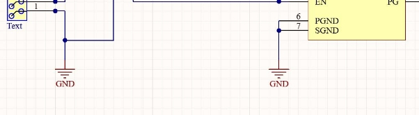
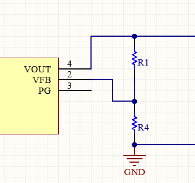
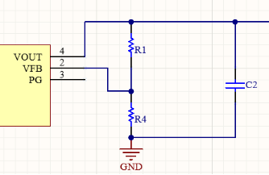
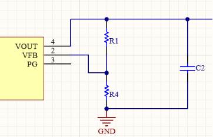
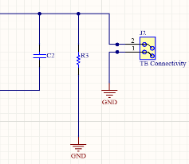
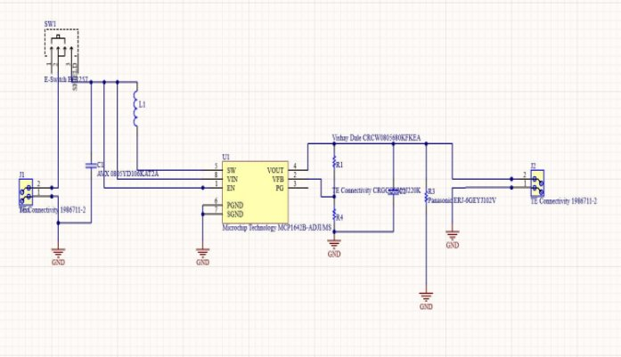

`                                                    `Origo Worskshop 2025  

`                                                `Handbook for PCB Desiginig  

What is Circuit Maker? 

` `It is a simulation and designing software, mainly used for electrical and electronics applications, particularly for circuit designing and analysis. It is also a platform for hardware design. All in all, it's a virtual laboratory. We need to simulate our models because: • We will be able to detect and rectify many mistakes without actual fabrication. • It offers a lot of flexibility while testing. • Saves material costs. Other uses of circuit maker: -Accurate analysis. -Single-chip software debugging -PCB automatic layout and wiring  

1. Prerequisites before coming to the workshop  

a. Download the Software Circuit Maker: Go to their official Website circuitmaker.com and sign in-> Download the Software following their instructions b. Sign in after installing the software with the mail id and password you used while downloading the software.  

Create a new Project by going to files-> New project And add the following components to it 

2. Add the components listed below to ‘add to favourites list’ in the section ‘Library’. a. Manufacturer Part Number 1986711-2(TE Connectivity) b. Manufacturer Part Number SPM3012T-4R7M-LR( Inductor 4.7uH) c. Manufacturer Part Number MCP1642B-ADJI/MS d. Manufacturer Part Number EG1257(Switch) e. Manufacturer Part Number CRCW0805680KFKEA Vishay(Resistor-680k ohm) f. Manufacturer Part Number Panasonic ERJ-6GEYJ102V (Resistor- 1k ohm) g. Manufacturer Part Number 0805YD106KAT2A 4 h. Manufacturer Part Number 598-8170-107F 

   3. Aim: To design a booster converter for the application of stepping up DC-DC Voltage  

PCB LAYOUT: 

Step by step guide for making the schematic: 

1. Create a new project-> after adding the above components into the facourites list-> go to the project in the left side of the window and right click on the project you created->Add new to project-> Schematic 
1. After you have the schematic window-> add all the components one by one into the schematic document and connect them as per the following guidelines: 

   Step 1: 

   Connect the 2nd terminal of the connector to the 2nd terminal of   the switch  

   

   2\.Connect the 3rd terminal of the switch to the inductor 

   

3. Connect the capacitor  common to  the inductor and 3rd terminal of the switch 

And connect the capacitors other end to the 1st terminal of the booster ic, inductor to the 5th terminal of the ic 

4. Obtain ground ports from home->power port-> ground port and connect them as below 

   

5. Repeat the connections on the right side too, with 2 more resistors added and connected to the ic 

    

   

   

   And finally your schematic looks like this  

After you have designed the circuit 

1. Validate the project by going to Project->Validate project->and go to messages-> if all the connections are correct you get no syntax error 
1. If everything is correct go to your project->right click->add new to project-> PCB 
1. In the pcb layout, go to project->next to validate project you have import changes->validate all and execute all changes and import the components into the pcb layout 
1. Follow the steps shown in the lecture in placing them  
1. Resize the board shape by going to home->Board shape->Edit the board shape 
1. Set the origin by going to home-> in the origin tab (far right corner)-> click on set 
1. Drag the arrow to the corner of the board and set the origin 
8. For routing-> space+r 
8. Polygon pour-> in home tab 

Thank you. 
