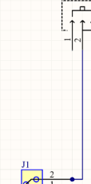

<!-- Summary -->

PCB Designing

<!--more-->

### **What is PCB?**

Printed Circuit Boards (PCBs) are the backbone of modern electronic devices. They mechanically support and electrically connect various electronic components using conductive pathways, pads, and other features etched from copper sheets laminated onto a non-conductive substrate. PCBs are integral to modern electronics, from small gadgets like smartphones to large industrial machinery.

#### **Why Use a PCB?**
- **Compact Design:** Organizes components into a small and efficient layout.
- **Reliability:** Reduces wiring errors and enhances durability.
- **Customization:** Allows for complex circuit designs tailored to specific applications.
- **Mass Production:** Easily replicable for large-scale manufacturing.

---

### **PCB Design Process**

Designing a PCB involves several steps:
1. **Schematic Creation:** Begin by creating a circuit diagram to define the relationships between components.
2. **Component Selection:** Choose and position electronic parts needed for the circuit.
3. **PCB Layout:** Convert the schematic into a physical board layout, considering size, routing, and connectivity.
4. **Simulation & Validation:** Test the design virtually to detect and fix potential issues.
5. **Fabrication:** Manufacture the PCB using industry processes.

---

### **What is CircuitMaker?**

**CircuitMaker** is a powerful and user-friendly PCB design and simulation software. It is widely used in electronics for designing, simulating, and analyzing circuits. Acting as a virtual laboratory, CircuitMaker helps designers identify and rectify errors before manufacturing.

#### **Why Use CircuitMaker?**
- **Error Detection:** Helps detect and fix design flaws early.
- **Cost Efficiency:** Reduces material waste by simulating designs before physical fabrication.
- **Flexibility:** Allows for easy modifications during testing.

#### **Additional Benefits of CircuitMaker:**
- Precise analysis and simulation.
- Single-chip software debugging.
- Automatic PCB layout and wiring.

---

### **Getting Started with CircuitMaker**

#### **Prerequisites**
1. **Download CircuitMaker:**
   - Visit [circuitmaker.com](https://www.circuitmaker.com).
   - Sign up for an account and follow the download instructions.
2. **Installation and Login:**
   - Install the software and log in using the credentials created during signup.
3. **Create a New Project:**
   - Navigate to **File → New Project** to start a new design.

---

### **Component Library Setup**
Add the following components to your "Favorites" list in the **Library**:
- **Manufacturer Part Numbers:**
  - 1986711-2 (TE Connectivity)
  - SPM3012T-4R7M-LR (Inductor 4.7uH)
  - MCP1642B-ADJI/MS (Booster IC)
  - EG1257 (Switch)
  - CRCW0805680KFKEA Vishay (Resistor - 680k ohm)
  - Panasonic ERJ-6GEYJ102V (Resistor - 1k ohm)
  - 0805YD106KAT2A (Capacitor)
  - 598-8170-107F (LED)

---

### **Design Objective**
The goal is to design a **boost converter circuit** for stepping up DC voltage using CircuitMaker.

---

### **PCB Design Steps**

#### **Schematic Creation**
1. **Start a Schematic:**
   - Go to your project, right-click, and select **Add New to Project → Schematic.**

2. **Add Components:**
   - Place components from the library onto the schematic canvas.
   - Connect them using the following steps:

#### **Step-by-Step Guide for Connections**
1. **Connect the Connector:**
   - Connect the second terminal of the connector to the second terminal of the switch.

   

2. **Add the Inductor:**
   - Connect the third terminal of the switch to the inductor.

   

3. **Attach the Capacitor:**
   - Connect one end of the capacitor to the inductor and the switch's third terminal.
   - Connect the capacitor’s other end to the booster IC’s first terminal.

   

4. **Ground Connections:**
   - Add ground ports from **Home → Power Port → Ground Port** and connect as shown:

   

5. **Complete the Circuit:**
   - Add resistors and complete connections to the IC terminals.

     
   

   - The final schematic should look like this:  
     

---

#### **Validation**
1. **Validate the Design:**
   - Go to **Project → Validate Project** to check for errors.

2. **Resolve Errors:**
   - Ensure there are no syntax errors before proceeding.

---

#### **PCB Layout**
1. **Create a PCB Layout:**
   - Add a new PCB to the project by right-clicking and selecting **Add New to Project → PCB.**

2. **Import Changes:**
   - Go to **Project → Import Changes**, validate, and execute all changes.

3. **Board Layout:**
   - Resize the board shape from **Home → Board Shape → Edit Board Shape.**
   - Set the origin by dragging the arrow to the board’s corner.

4. **Routing:**
   - Use **Space + R** for routing connections.
   - Add polygon pours from the **Home tab.**

---

#### **Final Output**
Your finalized PCB layout will be ready for manufacturing.

---

**PCB Layout Preview:**  

