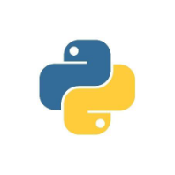
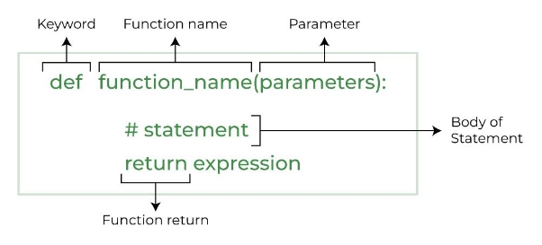

<!-- Summary -->

Python For Beginners

<!--more-->

## What is Python?

Python is a high-level, general-purpose programming language. It is known for its simplicity and readability. Python is ideal for beginners and widely used in various fields like web development, data science, and automation.



---

## What is Python Coding?

### Interpreter

An **interpreter** is a program that translates a programming language into a comprehensible language. It converts high-level language to an intermediate language and contains pre-compiled code, source code, etc.  
In Python, the Python interpreter reads Python code, interprets it, and executes it line by line.

### Comments

**Comments** are lines in a program ignored by the interpreter or compiler. They do not affect the execution of the code and are used to add explanations, notes, or reminders.  

Types of comments in Python:  
1. **Single-line comments**: Start with `#`.  
2. **Multi-line comments**: Enclosed in triple quotes (`'''` or `"""`).

---

## Variables

Variables in Python are used to store data that can be used and manipulated by the program. Python is dynamically typed, so you don't need to specify the type of a variable.

---

## Keywords

Keywords in Python are reserved words with special meanings. They cannot be used as variable names, function names, or any other identifiers. Examples include `if`, `else`, `while`, `for`, `import`, `def`, and `return`.

---

## Input and Print

- **Input**: The `input()` function allows users to input data during program execution.  
- **Print**: The `print()` function outputs data to the monitor.  

Example:  
```python
a = input('Enter your name: ')
print(a)
# Output:
# Enter your name: Jeff
# Jeff
```

---

## Data Types

Python supports various data types:  

- **Numeric types**: `int`, `float`, `complex`  
- **Text type**: `str`  
- **Boolean type**: `bool`  
- **Sequence types**: `list`, `tuple`, `range`  
- **Mapping type**: `dict`  
- **Set types**: `set`, `frozenset`  
- **Binary types**: `bytes`, `bytearray`, `memoryview`  
- **None type**: `None`

### Numbers
Examples:  
```python
x = 5       # int
y = 4.9     # float
z = 5 + 5j  # complex
```

### Strings
Strings are sequences of characters enclosed in quotes.  
Examples:  
```python
string = 'Hello, World!'
print(string[0:5])  # Slicing: Output -> Hello
```

### Boolean
Boolean values represent `True` or `False`.  
Examples:  
```python
p = 10
q = 5
print(p > q)  # Output: True
```

---

## Lists

A **list** is a built-in data structure used to store an ordered collection of items.  

### Creating a List
```python
my_list = [1, 2, 3, 4, 5]
mixed_list = [1, "hello", 3.14, True]
```

### Accessing Elements
```python
print(my_list[0])     # Output: 1
print(mixed_list[1])  # Output: hello
print(my_list[-1])    # Output: 5
```

### Slicing
```python
subset = my_list[1:4]  # Elements from index 1 to 3
print(subset)          # Output: [2, 3, 4]
```

### Modifying a List
```python
my_list[2] = 10
print(my_list)  # Output: [1, 2, 10, 4, 5]
```

### Common Methods
```python
my_list.append(6)         # Adds an element to the end
my_list.remove(4)         # Removes the first occurrence of a value
my_list.insert(2, "new")  # Inserts an element at a specific index
print(my_list)            # Output: [1, 2, 'new', 10, 5, 6]
```

---

## Tuples

A **tuple** is an immutable, ordered collection of items.  

### Creating a Tuple
```python
my_tuple = (1, 2, 3)
single_item_tuple = (1,)  # A comma is required for single-item tuples
```

### Accessing Elements
```python
print(my_tuple[0])  # Output: 1
```

### Unpacking Tuples
```python
coordinates = (10, 20)
x, y = coordinates
print(x, y)  # Output: 10 20
```

---

## Dictionaries

A **dictionary** stores a collection of key-value pairs.  

### Creating a Dictionary
```python
my_dict = {"key1": "value1", "key2": "value2", "key3": "value3"}
```

### Accessing Values
```python
print(my_dict["key1"])  # Output: value1
```

### Modifying a Dictionary
```python
my_dict["key2"] = 42       # Update value
my_dict["new_key"] = 99    # Add new key-value pair
del my_dict["key3"]        # Delete a key-value pair
print(my_dict)             # Output: {'key1': 'value1', 'key2': 42, 'new_key': 99}
```

### Common Methods
```python
for key, value in my_dict.items():
    print(f"{key}: {value}")
```

---

## Operators

### Arithmetic Operators
- Addition: `+`  
- Subtraction: `-`  
- Multiplication: `*`  
- Division: `/`  
- Modulus: `%`  
- Exponentiation: `**`  
- Floor Division: `//`  

### Comparison Operators
- Greater than: `>`  
- Less than: `<`  
- Greater than or equal to: `>=`  
- Less than or equal to: `<=`  

---

## Conditional Statements

Control the flow of execution with `if`, `elif`, and `else`.  
Example:  
```python
x = 3
if x == 2:
    print("x is 2")
elif x == 3:
    print("x is 3")
else:
    print("x is not 2 nor 3")
```

---

## Loops

### For Loop
Iterates over a sequence.  
Syntax:  
```python
for var in sequence:
    # Code to execute
```

### While Loop
Continues until a condition becomes `False`.  
Syntax:  
```python
while condition:
    # Code to execute
```

---

## Functions

Functions are blocks of reusable code.  
Example:  
```python
def hello():
    print("Welcome to ORIGO")
    return 1
```



---

## Modules

A **module** is a Python file containing functions and variables.  

Examples:  
- `math`  
- `re` (Regex)  
- `datetime`  
- `random`

---

## Libraries

Python libraries are collections of modules.  
Examples:  
- `numpy`  
- `matplotlib`  
- `opencv-python`

---

## Packages

A **package** is a directory of modules, including a special `__init__.py` file.  
Examples:  
- `numpy`  
- `pandas`

---

## External References for Further Reading

- [Python - GeeksforGeeks](https://www.geeksforgeeks.org/python-programming-language-tutorial/)  
- [Object Oriented Programming - YouTube](https://www.youtube.com/watch?v=Ej_02ICOIgs)

