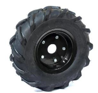
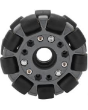
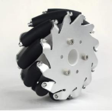
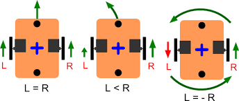
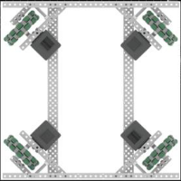
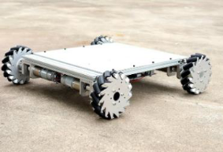

<!-- Summary -->

Understanding Wheels and Drives in Robotics and Vehicles

<!--more-->

Wheels and drive mechanisms are fundamental components of robotic and vehicular systems. The choice of wheel type and drive system greatly influences a machine’s mobility, agility, and efficiency. This document explores the types of wheels and drives, emphasizing their unique features and applications.

---

## **Types of Wheels**

### **1. Traction Wheels**
Traction wheels are designed to maximize grip and stability. Their tread patterns are optimized for specific terrains such as off-road, wet, or icy conditions. These wheels ensure stability by distributing weight evenly and reducing slippage, making them ideal for scenarios requiring high levels of traction. Key design considerations include:
- **Contact Patch Size:** Determines the area of the wheel in contact with the surface.
- **Tire Pressure:** Affects grip and durability.
- **Dynamic Load Distribution:** Maintains balance and enhances performance under varying loads.

### **2. Omni Wheels**
Omni wheels are advanced wheels that allow multidirectional movement. Their unique design includes rollers along the circumference, enabling:
- **Forward and Backward Movement:** While providing lateral slide capabilities.
- **Multidirectional Control:** Achieved by coordinating the rotation of multiple wheels.
Omni wheels are widely used in robotics for precise movement and are particularly suited for environments requiring high maneuverability.

### **3. Mecanum Wheels**
Mecanum wheels, a type of omnidirectional wheel, feature rollers positioned at a 45-degree angle to the wheel’s axis. These rollers allow:
- **Diagonal and Lateral Movement:** Without changing the orientation of the vehicle.
- **Exceptional Flexibility:** Ideal for precise robotic applications.
The angled rollers generate forces that combine to enable smooth motion in any direction, making mecanum wheels a preferred choice in industrial robotics and competition scenarios.

---

## **Types of Drives**

Drive mechanisms power and control the movement of wheels, enabling motion in robotic and vehicular systems. The drive system determines how a robot moves and interacts with its environment.

### **1. Differential Drive**
A differential drive system uses two independently powered wheels, typically mounted on either side of the robot. By adjusting the speed and direction of each wheel, this system enables:
- **Forward and Backward Motion**
- **Sharp Turns**
- **In-Place Pivoting**
Differential drives are simple and efficient, making them suitable for various robotic applications.

### **2. Holonomic Drive**
Holonomic drive systems, such as those using omni or mecanum wheels, offer unmatched freedom of movement. Key capabilities include:
- **Simultaneous Translation and Rotation:** Independent control of movement along X, Y, and Z axes.
- **Enhanced Agility:** Perfect for tight spaces and applications requiring precise motion.
Holonomic drives are ideal for robots that need to navigate complex environments.

### **3. Mecanum Drive**
A specialized form of holonomic drive, the mecanum drive uses four wheels with angled rollers. This design allows:
- **Omnidirectional Movement:** Forward, backward, sideways, diagonally, and in-place rotation.
- **Exceptional Maneuverability:** Ideal for industrial tasks and robotics competitions.
The mecanum drive’s versatility makes it a go-to choice for environments demanding precision and adaptability.

---

## **References**
- [Understanding Traction Wheels](https://youtu.be/Xrc0l4TDnyw?si=2upU3Cw8ip9Y9Meb)  
- [Mecanum Drive Explained](https://youtu.be/fx6bxPJ6BEs?si=Cq_6NMTR4jCjQVHn)  

By understanding the various wheel types and drive systems, designers and engineers can choose the best configurations to meet specific performance and application requirements.