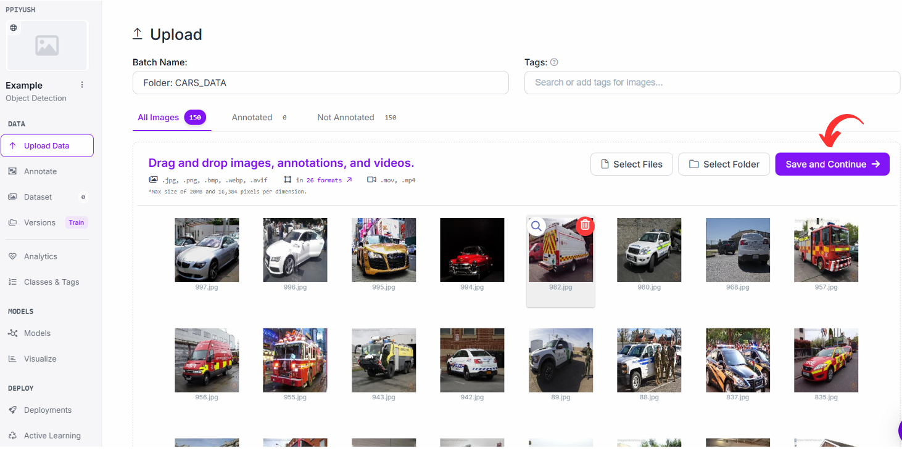

<!-- Summary -->

Step-by-Step Process to Train Your Own Data (YOLOV8).

<!--more-->

## Main steps in making your own YOLOv8 Model

1. Collect and organize your data.
2. Label your images.
3. Setup environment & train Your model.
4. Test and Deploy.

## 1. Collect and Organize your Data

Collect a diverse set of images relevant to your project. Ensure images are of high quality and represent the full spectrum of your subject matter.

## 2. Label your images

- Go to [Roboflow](https://app.roboflow.com/login)
- Create a Roboflow (if you don't have)

- Click on `New Project`

- Name your Project and mention Annotation group(the Object for which you wanna train).
- Make sure you have selected the **Object Detection**.
- Click **Create Public Project**.
- Click on select folder and **Select Your datasets(images)**.

- Verify your Images and Click on Save and Continue and wait for images to be uploaded.

- Click on **Start Manual Labelling**

- You can also invite your friends for labelling
- Click **Assign to Myself**

- Now Click on **Start Annotating** .(If some different Kind of window is appearing for you just search for Start Annotating button.)

- Make Bounding Box over your desired Object and click on save before making new box (For me the object is a car, so I am making bounding box over the car.)
- Repeat the same process for all the Images.

- Once you have completed the process of making box around your image, click on back button to the left side.
- Click on ADD Images to Dataset.(Since I have labelled only 11 images that’s why it is showing Add 11 images to Dataset.)

- Click on the Method option arrow (Drop Down Window will appear).
- Click on Split Images Between Train/Valid/Test.
- Adjust the slider and distribute images in different folder according to your need(I am keeping the default values). Then click on **Add Images**.

- Click On Dataset and verify your Data.

- Click on versions > Continue > Continue > Create

- Download dataset.

- Select Format as Yolov8 and Downlaod Options as Show Downlaod Code and Click on Continue.

- Copy the code generated.

### Using prebuilt datasets

- If you don’t have datasets and want to use prebuilt datasets, then go to [Roboflow Universe](https://universe.roboflow.com/)

- Search for what you want to train.
- Choose and select project according to your desired requirements.
- Click On Datasets and choose the yolo model (Since we are using YOLOv*), Click on YOLOV8.

- Click on Download on my own and then click on Continue.
- Just like before, Select Yolov8 and Show download code and click on Continue.
- Copy the code generated.

## 3. Setup Environment & Train Your Model

1. Go to [Google Colab](https://colab.research.google.com/drive/1sErI9rF0vMAj4OyTBslRUEYiyrVgP02h?usp=sharing)
2. Click on File > Save a copy in drive

3. Click arrow next to Connect > Change runtime type. Choose T4 GPU and click Save.

4. Click on Connect (It will Take some time to connect. Once connected, it will show Green tick option)
5. Click the Run button to left of each cell to run it. Install ultralytics package by clicking the run button next to the cell.

6. Import necessary packages by clicking the run button on `Importing YOLO from Ultralytics` cell.
7. In the `Import our Datasets` cell, paste the code you got from either from Roboflow (If you are labelling your own images) or paste the code you got from Roboflow universe if you are using Premade Datasets. 
8. Click on Run button to run the code and import the datasets.
9. Click on File option and check whether you have imported datasets properly.

10. Click 3-dot menu option on data.yaml and copy it's path.

11. Paste path in `data=`. Adjust the epoch. It's better to keep higher epoch to get better result (at the expense of time). Run the cell and wait for training to be done.

12. Once the training is done, Click on File again. RUN > DETECT > TRAIN > WEIGHTS. Download best.pt and last.pt.

---

**TRAINING IS DONE**

For testing, you can use the code provided [here](https://drive.google.com/drive/folders/10TTZ91JwMUc0oWYHsolvn7rhdbjO6n0L). Make sure to go through the Readme file of the code.